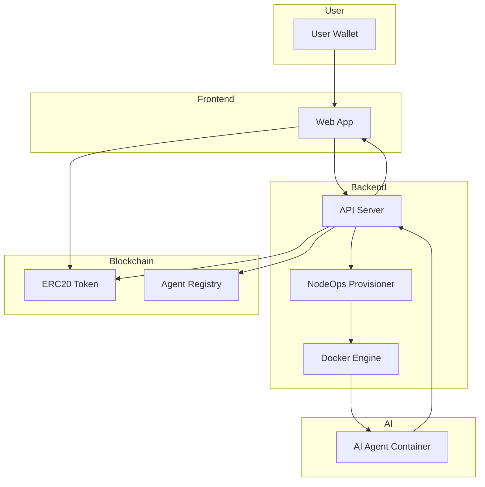
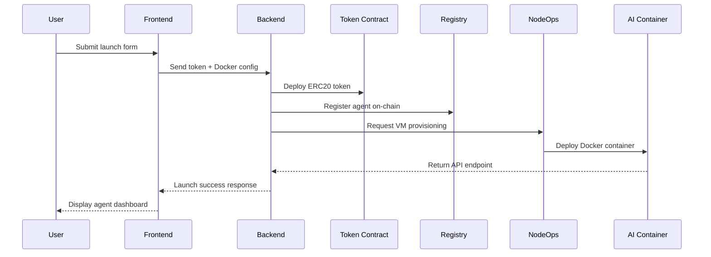
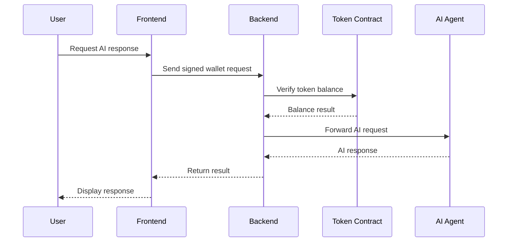
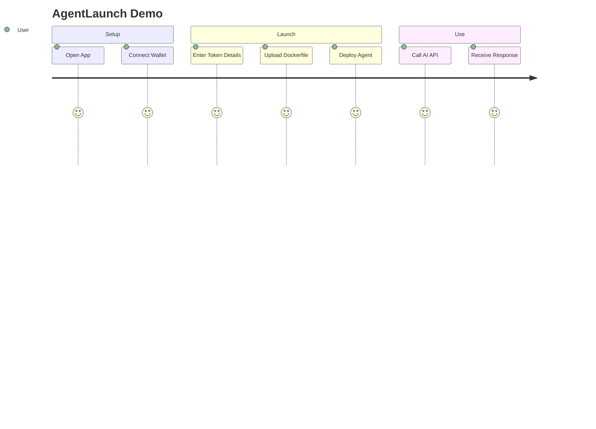

Perfect — here is a **clean, structured, judge-ready `TECHNICAL.md`** written exactly according to your template.

You can paste this directly into `docs/TECHNICAL.md`.

---

# Technical: Architecture, Setup & Demo

This document explains how the system works, how to run it locally, and how judges can evaluate it reproducibly.

---

# 1. Architecture

## 1.1 System Overview

AgentLaunch is a hybrid on-chain/off-chain system that enables:

* Deployment of AI-backed ERC20 tokens
* On-chain registration of AI agents
* Automated cloud provisioning via NodeOps
* Docker-based AI container deployment
* Token-gated access to AI APIs

The system ensures that every launched token is verifiably tied to a functional AI agent deployed off-chain but registered on-chain.

---

## 1.2 Components

### Frontend (Web Application)

* Built with React / Next.js
* Wallet connection (MetaMask)
* Token launch interface
* Dockerfile upload
* Agent dashboard
* Real-time activity feed

Communicates with backend via REST API and directly with smart contracts using ethers.js.

---

### Backend (API Server)

* Node.js / Express server
* Smart contract interaction layer
* NodeOps VM provisioning handler
* Docker deployment controller
* Token-gating middleware
* Activity logging

Acts as orchestration layer between blockchain and AI infrastructure.

---

### Smart Contracts (BNB Smart Chain)

* ERC20 Token contract
* Agent Registry contract
* Ownership verification logic

Deployed on BNB Smart Chain Testnet.

---

### Infrastructure Layer

* NodeOps VM instances
* Docker containers
* AI agent runtime
* Public API endpoint generation

Each agent runs in an isolated container environment.

---

## 1.3 High-Level Architecture Diagram



---

## 1.4 Data Flow

### Agent Launch Flow



---

### Token-Gated API Flow



---

## 1.5 On-Chain vs Off-Chain

| On-Chain                   | Off-Chain          |
| -------------------------- | ------------------ |
| ERC20 token logic          | AI model inference |
| Agent registry             | Docker deployment  |
| Ownership records          | VM provisioning    |
| Token balance verification | API routing        |
| Event logs                 | Activity tracking  |

### Design Rationale

* On-chain ensures trust, transparency, and token ownership.
* Off-chain enables scalable AI inference and low latency.
* This avoids high gas costs while preserving economic security.

---

## 1.6 Security Model

### Smart Contract Security

* Based on OpenZeppelin ERC20 implementation
* No hidden mint functions
* Registry write access restricted
* Contract addresses verifiable via `bsc.address`

---

### API Security

* Wallet signature validation
* On-chain token balance verification
* Rate limiting middleware
* Input validation for Docker configs

---

### Infrastructure Security

* Isolated VM per agent
* Docker container sandboxing
* No shared runtime between agents
* Limited external exposure

---

# 2. Setup & Run

## 2.1 Prerequisites

* Node.js 18+
* npm or pnpm
* MetaMask
* BNB Testnet configured
* Testnet BNB from faucet
* Docker installed
* NodeOps account

---

## 2.2 Environment Setup

Create a `.env` file using `.env.example`:

```
PRIVATE_KEY=
BSC_RPC_URL=
NODEOPS_API_KEY=
JWT_SECRET=
PORT=4000
```

---

## 2.3 Install Dependencies

```
git clone <repo-url>
cd agentlaunch
npm install
```

---

## 2.4 Deploy Smart Contracts

```
npx hardhat run scripts/deploy.js --network bscTestnet
```

After deployment:

* Update `bsc.address` with contract addresses
* Verify contracts on BscScan (if applicable)

---

## 2.5 Start Backend

```
npm run backend
```

Runs at:

```
http://localhost:4000
```

---

## 2.6 Start Frontend

```
npm run dev
```

Open:

```
http://localhost:3000
```

---

## 2.7 Verification Steps

1. Connect MetaMask
2. Switch to BNB Testnet
3. Launch a new AI agent
4. Confirm token deployment transaction
5. Wait for VM provisioning
6. Test token-gated API call
7. Confirm access control works

---

# 3. Demo Guide

## 3.1 Access

Deployed:

```
https://production-bnb-openclaw.tyzo.nodeops.app/
```

Contract addresses:

See `bsc.address` file in repository root.

---

## 3.2 User Flow



---

## 3.3 Key Actions to Try

### 1. Connect Wallet

Expected: Wallet address displayed.

---

### 2. Launch Agent

* Enter token name & supply
* Upload Docker configuration
* Click deploy

Expected:

* Token contract deployed
* Agent registered
* API endpoint generated

---

### 3. Test Token Gating

* Attempt API call without tokens → Access denied
* Hold tokens → Access granted

Expected:

* 401 response without balance
* Valid AI output with balance

---

## 3.4 Expected Outcomes

| Action                    | Result                   |
| ------------------------- | ------------------------ |
| Deploy token              | Transaction confirmed    |
| Register agent            | On-chain event emitted   |
| Provision VM              | Agent endpoint generated |
| Call API (with tokens)    | AI response returned     |
| Call API (without tokens) | Access denied            |

---

## 3.5 Troubleshooting

| Issue            | Fix                   |
| ---------------- | --------------------- |
| Wrong network    | Switch to BNB Testnet |
| Insufficient gas | Get testnet BNB       |
| VM delay         | Wait 1–2 minutes      |
| Backend error    | Check `.env` values   |
| Contract error   | Confirm RPC URL       |

---
